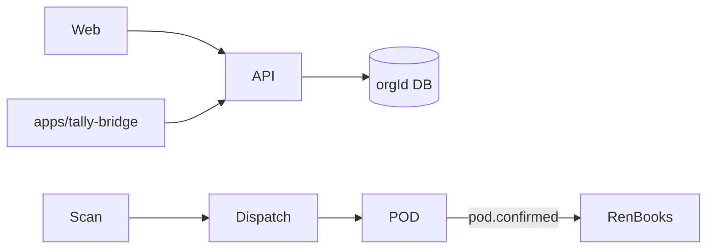

# Codebase graph

> Last updated: 2026-08-17 — Suite renverse routes + POD emit + tally onprem note  
> Hub: RenVerse `docs/ECOSYSTEM_GRAPH.md`

## Suite bridge

| Field | Value |
|-------|-------|
| appKey | `smartload` |
| displayName | SmartLoad |
| suiteRole | `addon` |
| SoR | Ops stock, barcode dispatch, POD |
| tenantKey | `orgId` |
| host | `smartload.renaissa.ai` |
| hub | RenVerse `docs/ECOSYSTEM_GRAPH.md` |
| pack | `docs/renverse/` |
| manifest | `renverse.manifest.json` |
| blocker | Full multi-tenant org incomplete; suite smoke via `apps/api/src/renverse/` · optional add-on |

### Membership

- Modes: `RENVERSE_MODE=standalone|suite` + `RENVERSE_APP_KEY=smartload`
- Entitlement: `hasAddon('smartload')` — **not** required for core Suite
- Health: `GET /renverse/status` · POD smoke: `POST /renverse/shipments/:id/pod`
- Tally: `SMARTLOAD_TALLY_MODE=onprem`

### Events produced / consumed

| Direction | Event | Peer |
|-----------|-------|------|
| Out | `smartload.pod.confirmed.v1` | RenBooks |
| In | `identity.*` | Identity |

### Bans

- No full WMS/ERP/e-commerce — stay scan + dispatch + POD · ISSA tools → this app API only

---

## Repo map

| Path | Role |
|------|------|
| `apps/web` | Vite + React UI |
| `apps/api` | API (`src/modules/*`, workers) |
| `apps/api/src/renverse/` | Suite addon OIDC + status + POD emit |
| `apps/tally-bridge` | Tally integration bridge |
| `packages/db`, `shared`, `ui` | Shared packages |
| `docs/renverse/` | Suite pack |

## Features

| Feature | UI (`apps/web/src/pages`) | API (`apps/api/src/modules`) |
|---------|---------------------------|------------------------------|
| Auth / users | `login`, `users` | `auth`, `users` |
| Dashboard | `dashboard` | `dashboard` |
| Products / barcode catalog | `products` | `products` |
| Inventory / stock | `inventory` | `inventory` |
| Orders | `orders` | `orders` |
| Scan | `scan` | `scan` |
| Dispatch | `dispatch` | `dispatch` |
| Vehicles / devices | `vehicles`, `devices` | `vehicles`, `devices` |
| POD | `pod` | `pod` → emit `pod.confirmed` |
| Clients | `clients` | `clients` |
| Tally | `tally` | `tally` + `apps/tally-bridge` |
| Reports / audit / settings | `reports`, `audit`, `settings` | `reports`, `audit`, `settings` |

## Frontend hot paths

- Router: `apps/web/src/App.tsx`
- Pages: `apps/web/src/pages/{scan,dispatch,pod,inventory,…}`

## Backend hot paths

- Server: `apps/api/src/server.ts`
- RenVerse: `apps/api/src/renverse/renverse.routes.ts`
- Modules: `apps/api/src/modules/*` (POD acknowledge emits `pod.confirmed`)
- Workers: `apps/api/src/workers/`

## Edges

## Hotspots

- `apps/web/src/pages/{scan,dispatch,pod,inventory}`
- `apps/api/src/modules/{scan,dispatch,pod,inventory,tally}`
- `apps/tally-bridge/`
- `docs/renverse/`
